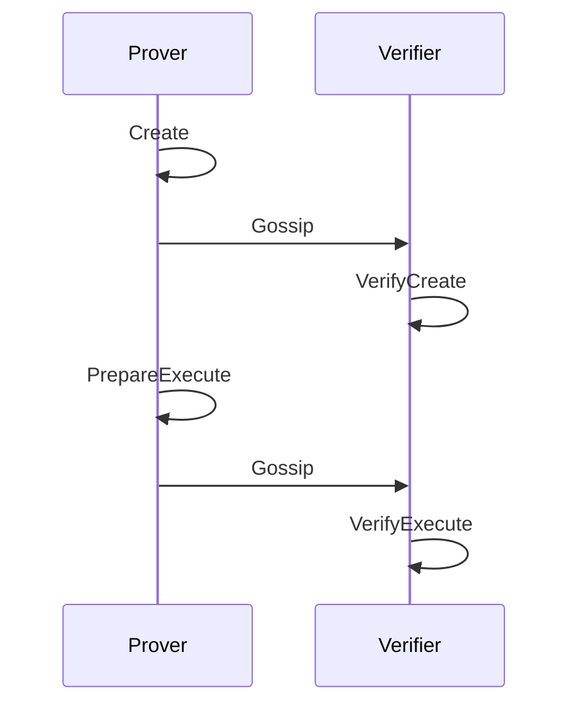

# The Murmur Protocol

A detailed mathetmatical description of the Murmur protocol. For getting started, read the [overview](../quick_start/overview.md).

## Background

### MMR
A [Merkle mountain range](https://docs.grin.mw/wiki/chain-state/merkle-mountain-range) (MMR) is an alternative to a Merkle tree. Merkle mountain ranges are append-only data structures where leaves are added from left to right, adding a parent as soon as two leaves exist. Unlike Merkle trees, an MMR does not need to be perfectly balanced yet still allows for efficient Merkle proofs of membership. In this document, we will use the following notation to represent an MMR with a given set of leaves $M \leftarrow MMR(leaves = \{l_1, ..., l_k\})$ and we will refer to the MMR root as $r \leftarrow M.root$.

In the same way as Merkle trees, an MMR allows for Merkle proofs to be constructed and verified. For an MMR $M \leftarrow MMR.New(leaves = \{l_1, ..., l_k\})$, a Merkle proof that $l_j$ is a leaf in the MMR is $\pi \leftarrow MMR.Prove(M.Leaves, l_j, j)$

The proof can be verified with $0/1 \leftarrow MMR.Verify(r, \pi, l_j)$, where $r \leftarrow M.Root$. If the function outputs $0$ then the proof is invalid, otherwise it is valid.

### Timelock Encryption

We define timelock encryption using a computational reference clock, $\mathcal{C}$.

> **Def.** A computational reference clock (CRC) is a stateful probabilistic machine $\mathcal{C}(1^k)$ that takes input a difficulty parameter $k$ and outputs an infinite sequence $w_1, w_2, ...$ in the following way. The initial state of $\mathcal{C}$ is $w_0$. It runs a probabilistic algorithm $f_\mathcal{C}$ which computes $w_\tau = f_{\mathcal{C}} (w_{\tau} - 1)$ and outputs $w_\tau$.
We write $w_\tau \leftarrow \mathcal{C}(1^k , \tau)$ for $\tau \in \mathbb{N}$ to abbreviate the process of executing the clock $\tau$ times
in a row, starting from initial state $w_0$ , and outputting the state $w_\tau$ of $\mathcal{C}$ after $\tau$ executions.

The parameters of the function $f_\mathcal{C}$ can be extended to include additional auxiliary input. On input of a string $aux \in \{0, 1\}^*$, it runs a probabilistic algorithm $f_\mathcal{C}$ which computes $w_{\tau} = f_{\mathcal{C}} (w_{\tau - 1}, aux)$ and outputs $w_\tau$.

With this, we define timelock encryption as encrypting messages to future states of the CRC. 

**Def.** Let $\mathcal{C}$ be a CRC and $\omega$ be some future state. Let $ID$ be a deterministic, collision-resistant function that maps each state $\omega$ to a unique string in $\{0,1\}^d$, for some $d > 0$ (likely a crypto hash function). Then **timelock encryption** is a cryptographic scheme that allows an arbitrary-length message $m \in \{0, 1\}^*$ to be encrypted such that the future output of a CRC at a specific step $\omega$ allows for the message to be decrypted. Specifically, our scheme is a hybrid encryption scheme which first uses AES-GCM to encrypt the message with a user provided ephemeral secret key. The secret key is then encrypted for the future. So first, choose $sk \xleftarrow{R} \mathbb{Z}_P^*$, then:

<!-- \begin{align*} -->
$$
ct \xleftarrow{R} TLE(m, ID(\omega), sk) \\
m \xleftarrow{R} TLD(ct, f_\mathcal{C}(\omega, AUX))
$$

When discussing timelock encryption, we will consider the CRC implemented as a blockchain's finality. As such, we will interchangeably use 'time' and 'block height' or 'block number'.

#### TOTP Generator
We will assume the usage of a time-based OTP generator (TOTP). Specifically, as described in [RFC 6238](https://datatracker.ietf.org/doc/html/rfc6238), a time-based variant of the HMAC-based OTP function. We can model this as two functions: 

$$
seed \xleftarrow{R} Setup(\lambda) \\
OTP \xleftarrow{R} \mathcal{G}(seed, t)
$$

Where the setup function takes some security parameter and produces a seed and $\mathcal{G}$ is a deterministic function mapping a seed and a time parameter to a pseudorandom output. The idea is that we will generate OTP codes not for time in the sense of a 24 hour clock, but time in the sense of block production. We now briefly describe the wallet creation and usage schemes, which involves both a client and a runtime module. The client is the “keyless wallet” client which allows users to securely generate the data required to submit onchain in order to interact with the wallet. As the client is air-gapped, there is no ‘leakage’ of codes generated in the client to the external world. 

## Protocol

This solution is inspired by the [Hours of Horus](https://eprint.iacr.org/2021/715) concept by Zindros. It is a new kind of keyless crypto wallet that allows the user to authenticate by providing knowledge of correct OTP codes. This wallet exists as a new type of keyless onchain account called a complete proxy. We make several improvements on the original protocol as outlined by Zindros. Specifically, rather than leveraging Witness Encryption, which is as of yet impractical, we use timelock encryption as defined above. Further, we use a Merkle mountain range over a Merkle tree, allowing us to specify an arbitrary number of OTP codes.

The protocol functions within a Prover-Verifier framework, where the prover convinces the verifier it has future knowledge of timelock encrypted OTP codes. In practice, the 'prover' is an end user and the 'verifier' is the blockchain runtime. We assume there is an eventually consistent gossip protocol that ensures messages are relayed to all participants by some upper bounded interval. The Murmur protocol consists of four functions, the prover functions: **Create**, **PrepareExecute** and verifier functions: **VerifyCreate**, **VerifyExecute**. In the future we will expand this to include **Update** and **Recovery** capabilities. Assume we are working over an elliptic curve $\mathbb{E}(\mathbb{F}_p)$ for a finite field $\mathbb{F}_p$ of prime order. Also assume we are using type III pairings. Let $G \in \mathbb{G}_1$ be a generator and $seed \in \{0, 1\}^*$. 

For a future block $b$, we define:

**Prover**
1. $\{root, \{(b, leaf_b)\}_{b \in B}\} \xleftarrow{R} Create(seed, B)$ 
     computes a Merkle mountain range and a map of future block numbers to leaves needed to rebuild the MMR and $B = \{b_1, ..., b_k\}$ is a limited block schedule.
2. $(\pi, comm, ciphertext, position) \xleftarrow{R} PrepareExecute(seed, b, AUX, \{(b, leaf_b)\}_{b \in B})$
     produce parameters required to prove knowledge of a future OTP code

**Verifier**
1. $0/1 \leftarrow VerifyCreate(name, root)$ 
     verify that the name is unique, then store the name to root mapping in memory.
2. $0/1 \leftarrow VerifyExecute(r, \pi,\sigma, AUX)$
     outputs 0 if the proof cannot be verified against the given root and with the given signate and aux data. Outputs 1 if verification is successful.

The protocol functions in sequential rounds of communication between prover and verifier, where the prover (end user) first computes a function which is then verified by the verifier (runtime). The runtime authorizes wallet (read: murmur proxy) creation anytime a unique name is provided, with no verification of the root, simply storing it in memory.

### Protocol Details

1. **Create**
$(root, \{(b, ct_b)\}_{b \in B}) \xleftarrow{R} Create(seed, B)$ where $B = \{b_1, ..., b_k\}$ is a limited block schedule

    The client-side begins by producing an input 'seed', an any length string (e.g. a password), along with a 'block schedule' $B$. The block schedule determines the *session* for the murmur wallet - the future block numbers when the wallet is usable. To be precise, an OTP code is generated for each of the input block numbers' identities. In a Murmur wallet, an OTP code can be 'consumed' on a 'just-in-time' basis, where a proof of knowledge of a future OTP code is submitted just before the expected block is finalized (for which it is encrypted). After this point, the OTP code should be considered expired (as it is essentially public information at this point). A wallet owner can consume this code exactly once before its expiration by proving knowledge of the code to the runtime. Thus, the size of the MMR describes the initial number of total transactions that the user can submit with this wallet before a wallet update is required.

    $$
        \{OTP_i\}_{i \in [n]} \leftarrow \{\mathcal{G}(seed, b_i)\}_{i \in [n]} \\
        sk_i \leftarrow HKDF(seed || OTP_i) \\
        \{ct_i\}_{i \in [n]} \xleftarrow {R} \{TLE(OTP_i, ID(b_i), sk_i)\}_{i \in [n]} \\
        M \leftarrow MMR(leaves = \{ct_i\}_{i \in [n]}) \\
        r \leftarrow M.root
    $$

    The user then gossips the data to the *verifier* (aka the Runtime). The prover also stores a map $\{(b_i, pos_i)\}_{i \in [n]}$ mapping block numbers to positions in the MMR. The secret keys should be destroyed immediately.
    
    The MMR data can be added to some offchain storage, such as IPFS or simply on the user’s device. In particular, we will assume we have a mapping of block number to leaf position for which the wallet is valid. This will be useful later on when accessing the MMR data to generate a Merkle proof. 
    
2. **VerifyCreate**:
    The prover stores a mapping between a well-known `name` and MMR roots, called the `Registry`. The verify create function:
    1. checks if the `name` is unique by querying the registry. If not, then abort.
    2. adds the name and proxy details to the Registry, mapping name to self-reported MMR root and MMR size.

    $$
        r \leftarrow Registry.Get(name) \\
        r = \emptyset \implies output: 0 \\
        () \leftarrow Registry.Set(name, \{root, size\}) \\
        output: 1
    $$

3. **Execute**: $(ct, h, \pi, pos, sk) \xleftarrow{R} Execute(seed, b, AUX, \{(b, ct_b\}_{b \in B})$
where $b \in B$
    
    Murmur wallets can be used within sequential 'sessions' as defined by the block numbers specified when the MMR was created. Users have 'up until' a block number to send a transaction within a given session, which they accomplish by preparing the data below. Assume that the block $b$ is the 'next' block number which is expected to be finalized. Then a prover must prepare data that can convince a verifier that they knew the OTP before it could be decrypted and also that the OTP code is at the correct leaf position within the MMR, without actually exposing the OTP code prior to decryption.
    
    Let $CALL \in \mathbf{C}$ be some valid unsigned runtime call, i.e. an unsigned transaction that can be executed on a blockchain, where $\mathbf{C}$ is the set of all valid runtime calls. This is the 'actual' call that they want to execute. Then they compute:
    
    $$
        OTP_b \leftarrow \mathcal{G}(seed, b) \\
        ct_b \leftarrow MMR.GetLeafAt(position = LeafIndexToPos(IndexOf(b, B))) \\
        \pi_b \leftarrow MMR.Prove(r, [(pos, ct_b)]) \\
        h_b \leftarrow H(OTP_b || CALL) 
    $$

4. **VerifyExecute**: $b \leftarrow Verify(r, \pi, ct, pos, \sigma, CALL, h)$
    
    The verify function allows the output of the `Execute` function to be trustlessly and publicly verified. In practice, the runtime implements this.

    1. Verify the Merkle proof $\pi$ by computing $b \leftarrow MMR.Verify(r, \pi_b, pos)$. If $b = 0$ then the protocol fails and the call is not proxied. If $b = 1$, then continue.
    2. Decrypt $otp \leftarrow TLD(ct, \sigma)$ and compute $\hat{h} \leftarrow H(OTP || CALL)$. Check if $h == \hat{h}$. If not, then the protocol fails, otherwise we are done and the call can be proxied.

In the future, We intend to include the following algorithms as well
5. **PrepareUpdate**
6. **VerifyUpdate**

### Security Analysis

We have not performed any analysis of the security of this solution beyond that which is laid out in the hours of horus construction. In general, the security of Murmur depends on the security of the Ideal Network, which ultimately depends on the security of our DKG implementation. We will update this section in the future once more work has been completed on this.

### Vulnerabilities

To investigate:

In which ways is a wallet vulnerable?

- if the IDN stops producing randomness then the wallet is unusable
- if the IDN's security is compromised then wallet security is compromised as well
    - so some centralization due to reliance on IDN
    - however, the IDN is a decentralized network itself, reducing the risks posed by centralization

## Future Work

his type of wallet requires that Murmur wallet user transactions be signed by an origin with sufficient funds to cover any transaction fees incurred during the execution of Murmur extrinsics. 

However, the protocol is designed to be flexible, allowing any valid signed origin and even enabling the option to set these transaction fees to zero. This flexibility supports a range of solutions depending on the specific use case. For example:

- **A paymaster model** could be implemented, where a third party sponsors the transaction fees. This approach could facilitate KYC or similar mechanisms, particularly when a semi-centralized API is needed to sign transactions.

- **An ephemeral origin** could be created specifically for individual transactions, allowing zero-fee Murmur transactions while enhancing anonymity. These temporary origins could be generated and destroyed for each transaction, adding an extra layer of privacy.
In this work, we have opted for a straightforward paymaster scheme, where Alice acts as the sponsor. However, expanding this solution to support additional models remains an open area for further development.

- We will investigate usage of **unsigned origins** rather than requiring users to rely on a third party or light client to obtain a signature. In this approach, murmur wallets simply send a transaction to the chain and verification of the sender is handled completely by the verification logic in the Murmur pallet.

- **Performance Improvements**
    - Implementing batch verification for execution and updates 
        - Consider the potential of using a Verkle Mountain Range (VMR) instead. 
        - This approach could allow the representation of multiple Murmur wallets within a single data structure.
        - Additionally, VMR enables more efficient 'multiproofs,' which could significantly optimize batch verification by proving a set of Murmur wallets, all interconnected within the VMR, in a more streamlined and efficient manner.