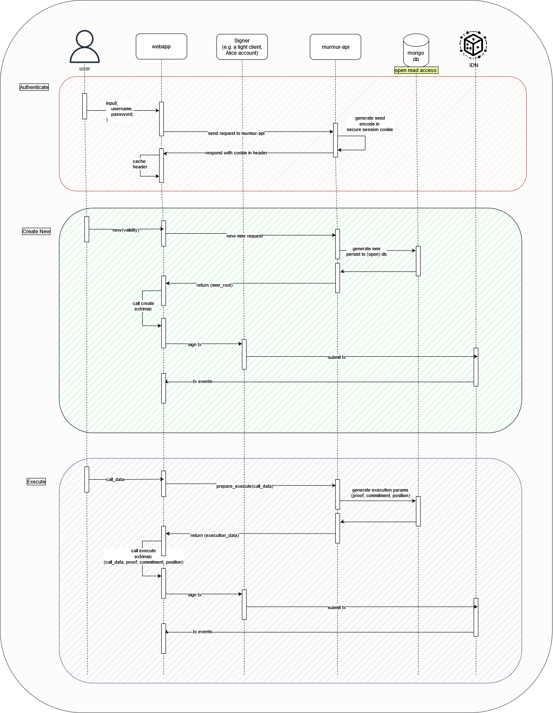

# Browser Integration

Murmur can be easily integrated into web applications with [murmur.js](https://github.com/ideal-lab5/murmur.js), a javascript wrapper that allows you to communicate with the `murmur-api`. Take a look at the [sequence diagram](#sequence-diagram) to see the end-to-end user flow.

## Setup
To get started, create a new javascript-based project (e.g. `npx init`). Then install the following dependencies

```shell
npm i @ideallabs/murmur.js axios @polkadot/api
```

(Optional) Run a local IDN Node

If you want to develop locally, you can run a local Ideal network node with Docker

``` shell
docker pull ideallabs/etf@latest
docker run -p 9944:9944 ideallabs/etf --tmp --dev --alice --unsafe-rpc-external
```

We will update this guide when we have finalized the DNS and such for a hosted node.

---

Configure setup axios and polkadotjs instances. We present a useful default here but there are many different ways an application may want to do this.

``` js
/* Polkadot API initialization */
const provider = new WsProvider('ws://127.0.0.1:9944')
console.log('Provider initialized')
const api = await ApiPromise.create({ provider })
console.log('API initialized')

/* Axios initialization */
const httpClient = axios.create({
  baseURL: 'https://murmur-api.idealabs.network',
  headers: {
    'Content-Type': 'application/json',
  },
})

/* Define the master account (optional, it falls back to `alice`) */
const keyring = new Keyring({ type: 'sr25519' })
const alice = keyring.addFromUri('//Alice')

/* MurmurClient initialization */
const murmurClient = new MurmurClient(httpClient, api, alice)
console.log('MurmurClient initialized')
```

Then initialize the murmur.js library, a signer **must** be specified. Murmur wallet holders cannot sign messages by themselves currently. In the future, we will modify this to use an embedded *light client*, allowing users to construct ephemeral signing keys on-demand rather than relying on externally owned accounts to sign on their behalf.

```js
import { MurmurClient } from "@ideallabs/murmur.js";
const keyring = new Keyring({ type: 'sr25519' })
const alice = keyring.addFromUri('//Alice')
const client = new MurmurClient(httpClient, this.api, alice)
```

## Authenticate (get a seed)

The `authenticate` function enhances a user's password with greater entropy and returns a sufficient seed to create or execute a murmur wallet as a secure session cookie.

``` js
await murmur.authenticate(username, password)
```

## Create a Murmur Wallet

The validity period specifies the duration (from creation) for which the wallet is valid. 

``` js
// the number of blocks (from submission) where the wallet will be active
let validity = 1000
murmur.new(validity, (result) => {
    if (result.status.isInBlock) {
        console.log(`Created new wallet with validity ${validity}`)
    }
})
```

## Execute a Murmur Wallet

To execute a call, first you must construct a valid runtime call with polkadotjs and pass it as a parameter to the execute function. For example, a balance transfer looks like

``` js
// use polkadotjs to construct some call
let amount = 100
let recipient = 'CuqfkE3QieYPAWPpwiygDufmyrKecDcVCF7PN1psaLEn8yr'
let balance = new BN(amount * Math.pow(10, 12))
// api is the the polkadotjs ApiPromise
let tx = await api
    .tx
    .balances
    .transferKeepAlive(recipient, balance)

murmurService.executeTransaction(tx, (result) => {
    if (result.status.isInBlock) 
        console.log('Balance transfer executed successfully.')
})
```

## Inspect Murmur wallets

Murmur wallets can easily be queried using the polkadot.js ApiPromise, not explicitly through the murmur.js library. Given a potential `name` of a murmur wallet, it's address and balance can be found with:

``` js
const username = 'some_name';
// check if there is a murmur wallet registered with the username
const result = await this.api.query.murmur.registry(username)
const humanResult = result.toHuman()
if (!humanResult || !humanResult.address) return { address: '', balance: '' }
// if it exists, get account data and extract the balance
const accountData = await this.api.query.system.account(humanResult.address)
const balance = accountData.data.free.toString()
return { address: humanResult.address, balance }
```

## Update a Wallet 

Coming soon.

## Examples

To see a fully functional example of the murmur.js library in action, you can investigate the [murmur-dapp](https://github.com/ideal-lab5/murmur-dapp), a basic dapp that allows creation of murmur wallets and execution of balance transfers.

You can also check out the [murmur discord bot](./discord.md), a bot enabling Discord users to create and use crypto wallets on the IDN.

## Sequence Diagram

The diagram below depicts the sequence of events and communication between each component of the system when authenticating with the API, creating a wallet, and executing calls. The reader should note that the murmur API does **not** sign calls and know anything about the chain, it is stateless and permisionless and its database has open read access.


