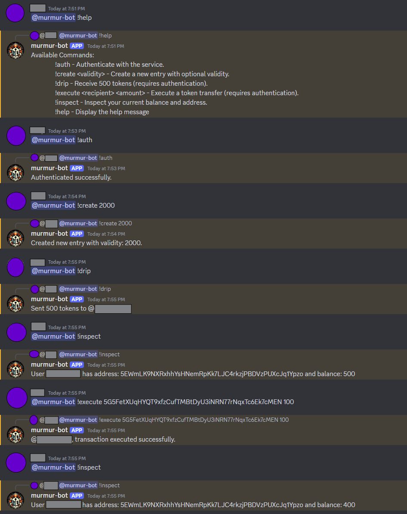

# Murmur on Discord

The [murmur discord bot](https://github.com/ideal-lab5/murmur-bots/tree/main/src/discord.js), built with [discord.js](https://discord.js.org/) and [murmur.js](https://github.com/ideal-lab5/murmur.js), enables Discord users to easily and securely create and execute crypto transactions on the Ideal Network from within Discord itself. This provides powerful new crypto capabilities for Discord, enabling both discord-wide wallets that can be used interoperably between servers, as well as server-specific crypto wallets and all of the economic implications that come with it. 

<div style={{ textAlign: 'center' }}>

</div>

## Setup

0. **Ideal Network**
This project is in development and requires you run a local IDN node. You can do this easily with Docker by running:

``` shell
docker pull ideallabs/etf:latest
docker run -p 9944:9944 ideallabs/etf --tmp --dev --alice --unsafe-rpc-external
```

1. **Bot Creation on Discord**
Create a new bot from the discord developer portal. You can follow the [official guide](https://discord.com/developers/docs/quick-start/getting-started#configuring-your-bot) to create a bot and add it to a server. Specifically, the bot requires permissions to read and write messages within a Guild. Follow the instruction carefully and this will ultimately result in a `BOT_TOKEN`, which we will use in the next step.

2. **Bot Setup**
Clone the repo https://github.com/ideal-lab5/murmur-bots and create a `.env.discord` file in the root directory with the following keys:

``` 
MAX_RETRIES=number of times to retry failed transactions
SECRET_SALT=any string
DISCORD_BOT_TOKEN=a valid discord bot token for the server
```

then from the root, run:

``` shell
# install dependencies
npm i
# run the bot
npm run discord
```

If you configured the bot correctly in step 1 then you will see the bot come online in the specified server. If it doesn't, revisit step (1) and ensure the bot has been granted sufficient privilieges and the token is correct.

## Usage

Any users in the server can interact with the Murmur Wallet Bot at any time by tagging the bot and invoking various commands. The bot uses murmur.js to call the murmur-api, so usage if very similar. Specifically, users first authenticate with the API, after which they can create wallets, execute balance transfers, and view their own public key and balance. Below, we detail the bot commands:

- **!auth**: Authenticate with the Murmur API to receive a seed.
Example: `@murmur-discord-bot !auth`

- **!create**: Create a new Murmur wallet for the Discord user for a given validity period (number of blocks from now until the wallet expires). The wallet will be named the same as the discord username. 
Example: `@murmur-discord-bot !create 1000`

- **!execute**: Execute a balance transfer by specifying an account address and amount
Example: `@murmur-discord-bot !execute 5Gg1jV56TPVY4Yd3JWpX2a2dQLhUhCu1jdKovMf1RwcpYeh2 1000`

- **!inspect**: Given a user has a wallet, inspect the wallet address and balance.
Example: `@murmur-discord-bot !inspect`

- **!drip**: Drip 500 tokens to users. This is a totally unprotected test faucet for demo purposes.
Example: `@murmur-discord-bot !drip`

- **!help**: Display a help message
Example: `@murmur-discord-bot !help`