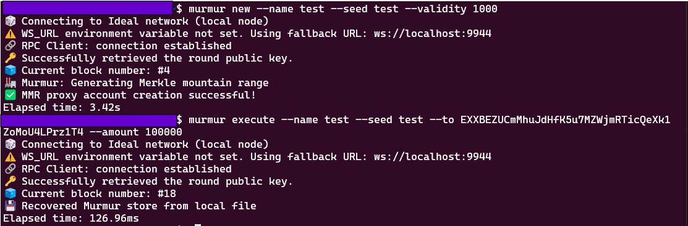

# Murmur CLI

Create and execute a Murmur wallet from a terminal.

The murmur-cli is a standalone client that creates and manages Merkle mountain range data for Murmur wallets. It can be used to create new Murmur wallets and to execute balance transfers from them on the Ideal Network.

## Installation

The easiest way to install the Murmur client is with [cargo](https://doc.rust-lang.org/cargo/) install. By default it will try to connect to a Substrate node running on `localhost:9944`. This can be configured by specifying the environment variable `WS_URL` (e.g. `WS_URL=ws://localhost:9945`).

``` shell
cargo install --git https://github.com/ideal-lab5/murmur
# verify the installation
murmur --help
```

```
Command line

Usage: murmur <COMMAND>

Commands:
  new      create a new murmur wallet
  execute  dispatch (proxy) a call to a murmur wallet
  help     Print this message or the help of the given subcommand(s)

Options:
  -h, --help     Print help
  -V, --version  Print version
```

You can use docker to easily run a local IDN validator node (with RPC exposed on localhost:9944) with:

``` shell
docker pull ideallabs/etf:latest
docker run -p 9944:9944 ideallabs/etf --tmp --dev --alice --unsafe-rpc-external
```

## Usage 

<div style={{ textAlign: 'center' }}>

</div>

### Create a Wallet

Murmur wallets are inherently *ephemeral* in nature since we can't generate an infinite Merkle mountain range. The 'validity' period determines the number of future blocks when the wallet will be executable. In the future we will implement an 'update' algorithm to allow exhausted wallets to be extended. 

``` shell
murmur new --name SomeUniqueName --seed 0xAnyString --validity 5000
```

### Execute a Balance Transfer

``` shell
murmur execute --name SomeUniqueName --seed 0xAnyString --to SomeRecipientAddress --amount 10
```

## Update a Wallet
Coming Soon