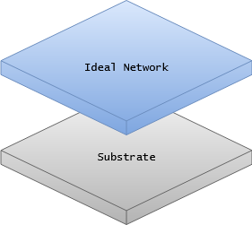
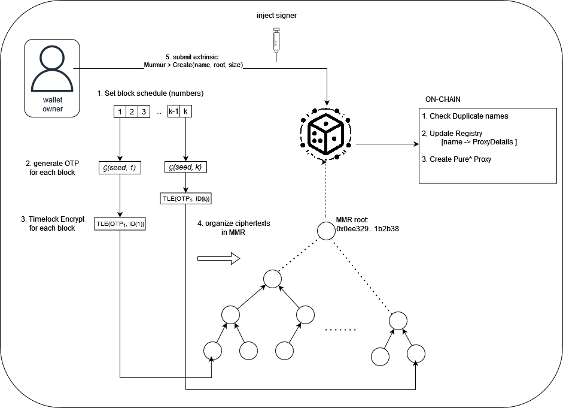
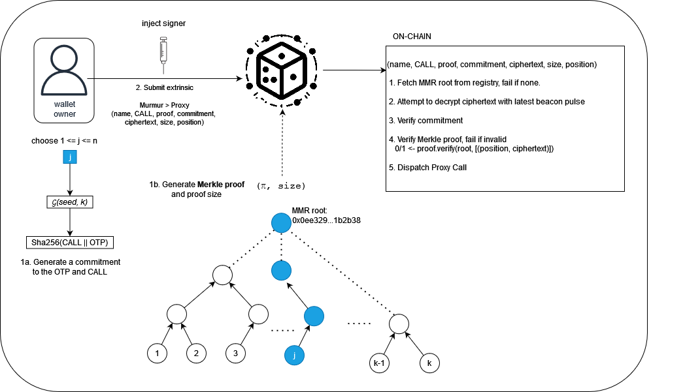
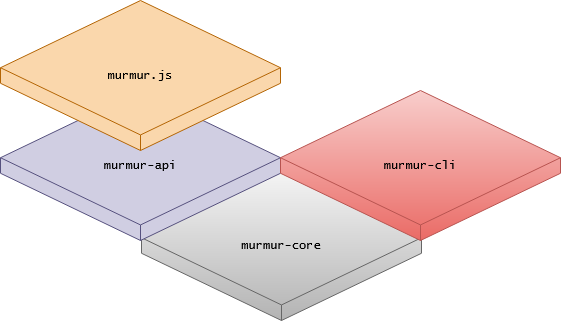
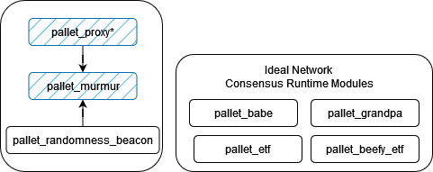

# Overview

Murmur is inspired by the [hours of horus](https://eprint.iacr.org/2021/715) protocol, though with several improvements to enhance practicality. Specifically, the murmur protocol relies on the [Ideal network](https://docs.idealabs.network), a substrate-based verifiable randomness beacon we developed in conjunction with the web3 foundation. Beyond outputting verifiable randomness, the IDN also enables efficient [timelock encryption](https://docs.idealabs.network/docs/learn/crypto/timelock_encryption), a cryptographic primitives where messages can be encrypted *for a future block* in such a way that the beacon randomness produced in that block acts as a decryption key for the data. 

1. [How it Works](#how-it-works)
2. [Architecture](#how-it-works)

## How it Works

A murmur wallet is a modified [pure proxy](https://wiki.polkadot.network/docs/learn-proxies-pure) set to have **no delegate** - meaning any origin can attempt to use the proxy. This type of proxy, which we call a **murmur proxy**, is the key to enabling seamless cross-platform account abstraction. Murmur proxies are created with a given unique name and self-reported root and size of a [Merkle mountain range](https://docs.grin.mw/wiki/chain-state/merkle-mountain-range/) whose leaves are timelock encrypted OTP codes. Instead of relying on signature verification to determine if a call can be proxied, a murmur wallet requires: successful timelock decryption, a valid merkle proof, and a commitment to the OTP code and the call to be proxied. The idea is that valid OTP codes must be supplied on a *just in time* basis, where a prover (the caller) attempts to convince a verifier (the runtime) that they had knowledge of the OTP code before it could have been decrypted and without revealing it. 

**Ideal Network**

The Ideal Network is a Substrate-based blockchain that enables a randomness beacon based on an [aggregatable BLS Signature Scheme](https://eprint.iacr.org/2022/1611). It produces fresh verifiable randomness each time the Ideal Network finalizes a block. Quite different than solutions like [drand](https://drand.love), this beacon uses DLEQ proofs to verify beacon output, enabling for more efficient onchain verification (as opposed to checking pairings). Beacon outputs are encoded in the runtime via the [randomness beacon pallet](https://github.com/ideal-lab5/pallets/tree/main/pallets/randomness-beacon). You can learn more about the Ideal Network by visiting the docs [here](https://docs.idealabs.network).

**Creating a Wallet**

The diagram below depicts the creation of a Murmur wallet, where $\mathcal{G}$ is a *secure time-based OTP code generator* and $ct \leftarrow TLE(OTP, ID(j))$ represents timelock encryption, where the OTP code $OTP$ is encrypted for block number $j$. The general idea is that we create OTP codes for future blocks and lock them with timelock encryption for each respective block. They are then organized into a Merkle mountain range which can be publicly stored. The user then submits an extrinsic to create a new wallet, specifying a *unique* name, root, and mmr size. The call can be sent from *any* origin (e.g. an ephemeral keypair built with a light client such as Substrate-connect). For formal proofs, we invite the reader to investigate the Hours of Horus paper mentioned above. . 

**Using a Wallet**

**Updating a Wallet**

You may have noticed that since we only generated OTP codes for a limited block schedule the wallet is inaccessible after block $k$ is finalized. This is indeed the case, that each murmur wallet can be considered as ephemeral. We have not yet implemented the update logic, but it will be coming soon!

## Components and Architecture

The murmur protocol is very flexible and can be implemented in a variety of ways to fit the context. In this section we detail the various components and how discuss how they connect to one another.

The basis of the murmur "stack" is the [murmur-core](https://github.com/ideal-lab5/murmur/tree/main/core) crate, which encapsulates the logic for constructing and proving things about the MMR data required for murmur wallets. The 

### Components

.png)

### Pallets

