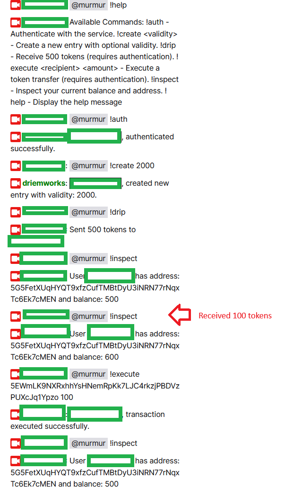

# Murmur on Twitch

Similar to the [discord bot](./discord.md), Murmur can also be used on [Twitch](https://www.twitch.tv/). The Twitch bot can be added to the chat to allow users to create, execute, and inspect channel-specific Murmur wallets. This guide walks you through how to setup the twitch bot and use it in the chat.

<div style={{ textAlign: 'center' }}>

</div>

## Setup

This is a guide for develoeprs to demosntrate lcoal setup and execution of the Twitch bot.

0. **Ideal Network**
This project is in development and requires you run a local IDN node. You can do this easily with Docker by running:

``` shell
docker pull ideallabs/etf@latest
docker run -p 9944:9944 ideallabs/etf --tmp --dev --alice --unsafe-rpc-external
```

1. Clone the murmur-bots repo and navigate to the twitch directory
``` shell
git clone git@github.com:ideal-lab5/murmur-bots.git
cd twitch/
# install dependencies
npm i
```

2. Acquire an Oauth Token for the twitch chat
Follow the directions at the link below to get an Oauth token for the channel you want to add the bot to: https://twitchapps.com/tmi/

You will get an oauth token as output, e.g. `oauth:ptoieoeobe33kfkw3jfnqfzijdjd`. Create a `.env` file in the root of the /twitch directory and create the entry `TWITCH_OAUTH_TOKEN=<your oauth token>`.

3. Configure Env Variables

```
TWITCH_CHANNEL="The twitch channel name (e.g. your username)"
TWITCH_BOT_USERNAME="The name of the bot (e.g. murmur)"
TWITCH_OAUTH_TOKEN="The token from above"
SECRET_SALT="Any 16 characters, don't expose this, more random = better"
```

4. Run the bot

``` shell
npm run start
```

## Usage

- **!auth**: Authenticate with the Murmur API to receive a seed.
Example: `@murmur !auth`

- **!create**: Create a new Murmur wallet for the Discord user for a given validity period (number of blocks from now until the wallet expires). The wallet will be named the same as the discord username. 
Example: `@murmur !create 1000`

- **!execute**: Execute a balance transfer by specifying an account address and amount
Example: `@murmur !execute 5Gg1jV56TPVY4Yd3JWpX2a2dQLhUhCu1jdKovMf1RwcpYeh2 1000`

- **!inspect**: Given a user has a wallet, inspect the wallet address and balance.
Example: `@murmur !inspect`

- **!drip**: Drip 500 tokens to users. This is a totally unprotected test faucet for demo purposes.
Example: `@murmur !drip`

- **!help**: Display a help message
Example: `@murmur !help`
